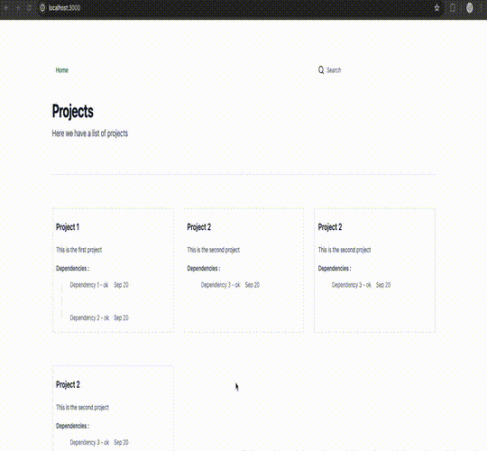

# API Dependency Management

A simple frontend project to manage API dependencies for various projects. 
In distributed systems, a single project often depends on multiple APIs. 
Instead of remembering or checking the source code for these API endpoints, 
this tool simplifies the process. It helps manage API dependencies and checks 
the health of APIs to ensure they are up and running.


You'll still need a backend to make API calls; otherwise, you'll encounter 
CORS errors. This backend can be a simple Node.js server or a serverless function 
that returns data from the APIs. In the constants folder, you'll find a sample 
of the data that the backend should return for the frontend to display.

[//]: # (![display.png]&#40;public/display.png&#41;)

Built using Nuxt.js.



## Setup

Make sure to install the dependencies:

```bash
# npm
npm install

# pnpm
pnpm install

# yarn
yarn install

# bun
bun install
```

## Development Server

Start the development server on `http://localhost:3000`:

```bash
# npm
npm run dev

# pnpm
pnpm run dev

# yarn
yarn dev

# bun
bun run dev
```

## Production

Build the application for production:

```bash
# npm
npm run build

# pnpm
pnpm run build

# yarn
yarn build

# bun
bun run build
```

Locally preview production build:

```bash
# npm
npm run preview

# pnpm
pnpm run preview

# yarn
yarn preview

# bun
bun run preview
```

# Thank You

Thanks for taking the time to check out this repository. Hope you find the tool 
useful and that it makes
managing your API dependencies a breeze. If it helps streamline your workflow
and saves you time, then I'll consider it a success!

If you have any thoughts, suggestions, or feedback, please don't hesitate to
reach out. Happy coding, and may your API dependencies never cause you any headaches!

# License

MIT License

